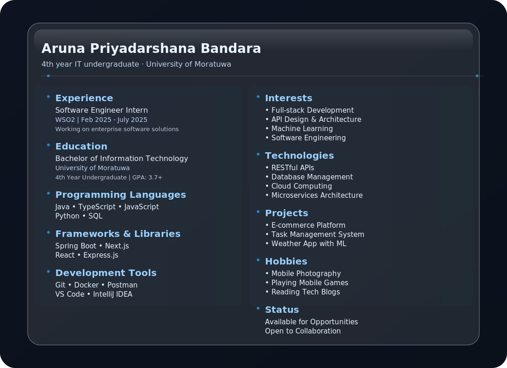

# Hi there, I'm Kasun Shakthi 👋

🚀 **Full-stack Developer | Passionate about Web Apps & Real-time Systems**  

  

---

## 🌟 About Me

  

---

## 🛠️ Tech Stack & Tools

  

  

  

---

## 📌 Featured Projects
### 🏙️ Virtual City - E-commerce Platform  
🔹 Role-based Admin, Seller, and Buyer dashboards  
🔹 Real-time notifications with WebSockets  
🔹 Analytics dashboards with charts & stats  
[🔗 View Repository](https://github.com/your-repo-link) | [🌍 Live Demo](https://your-live-demo-link)

---

## 📈 GitHub Stats
  

---

## ✨ Fun Fact
⚡ I love solving problems with **real-time systems** — if something can be instant, I’ll build it that way 😄

---
