# Hi there, I'm Kasun Shakthi 👋

  

---

## 🌟 About Me

🎯 **Passionate Full-Stack Developer** with a love for creating seamless digital experiences  
💡 I specialize in building **scalable web applications** and **real-time systems** that solve real-world problems  
🌐 From crafting pixel-perfect frontends to architecting robust backends, I enjoy every layer of development

### What drives me:

- 🚀 **Innovation First**: Always exploring cutting-edge technologies and best practices
- ⚡ **Performance Obsessed**: If it can be faster, I'll make it faster
- 🤝 **Collaboration**: Love working with teams to bring ambitious ideas to life
- 📚 **Continuous Learning**: The tech world never stops evolving, and neither do I

---

## 🛠️ Tech Stack & Tools

  

  

  

---

## 📌 Featured Projects

### Travel Booking Sri Lanka - Tourism platform

🔹 Role-based Admin, Tourist, Vehicle owner, and Hotel owner dashboards  
🔹 Real-time status tracking with WebSockets    
[🔗 View Repository](https://github.com/WeerasingheMSC/Tourism_site.git) | [🌍 Live Demo](https://travelbookingsrilanka.com)

---

## 📈 GitHub Stats

  

---

## ✨ Fun Fact

⚡ I love solving problems with **real-time systems** — if something can be instant, I’ll build it that way 😄

---
